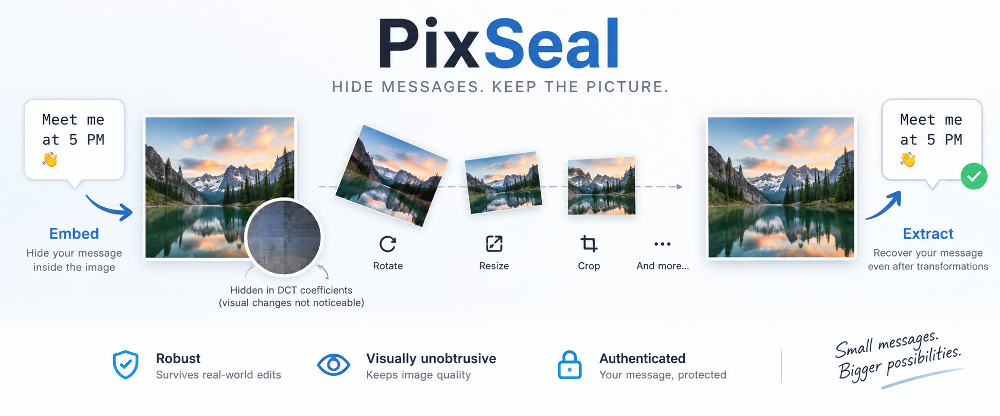

# PixSeal



PixSeal is an experimental, pure-Go **robust image steganography** CLI for
hiding short authenticated messages inside images. It embeds protected payload
bits into luminance DCT coefficients while keeping the resulting changes
visually unobtrusive under normal viewing conditions.

Current development line: **v0.2.0 build 9**. The last stable release is
**v0.1.0**.

PixSeal is designed as a hidden-data channel rather than an ownership-marking
product. Digital watermarking techniques are part of the mechanism used to
obtain robustness; the project goal is robust steganography for short messages.
The core format stores arbitrary bytes. The current CLI exposes them as UTF-8
text through `-message`.

The project direction was initially inspired by the general idea demonstrated by
systems such as Google SynthID: machine-readable information can be embedded in
media while retaining useful robustness after transformations. PixSeal is an
independent classical DCT implementation; it does **not** implement, reproduce
or claim compatibility with Google's SynthID algorithm.

PixSeal does not claim statistical steganographic undetectability. It has not
undergone a cryptographic or steganalytic security audit.

Project evolution and planned work are tracked separately in [`HISTORY.md`](HISTORY.md)
and [`TODO.md`](TODO.md). Release-facing changes remain in [`CHANGELOG.md`](CHANGELOG.md).

## What's new in v0.2.0 build 9

Build 9 keeps **format v3 bit-for-bit unchanged** and expands the direct
DCT-lattice basis bank introduced in builds 7/8. The decoder still represents a
candidate carrier geometry by transformed horizontal and vertical lattice basis
vectors (`u`, `v`), but the promoted discrete bank now covers two anisotropy
magnitudes in both orientations:

```text
110%x90%
 90%x110%
105%x95%
 95%x105%

rotation: -45..+45 degrees at 0.25-degree spacing
profile:  robust composed-geometry baseline
edit order: anisotropic scale -> rotation
```

The 105%x95% / 95%x105% cases are important because they show that the direct
lattice representation is not tied only to the original +/-10% anchors. A
prototype that tried to refine `u` and `v` more continuously also recovered
positive cases, but made negative extraction too expensive; it is therefore
**not promoted** in build 9. The runtime remains a fixed, reviewable basis bank.

The search budget is explicit:

```text
4 basis shapes
361 angles per shape
1444 sparse lattice probes maximum

anchor shapes (110x90 / 90x110): up to 48 quick candidates each
moderate shapes (105x95 / 95x105): up to 240 quick candidates each
576 stronger repetition/coherence evaluations maximum

4 matrices x 3 phases reach full authenticated aggregation maximum
12 full-carrier authenticated probes maximum
```

The larger bounded shortlist for the moderate anisotropies is deliberate. Real
photographs showed stronger pixel-phase sensitivity near 105%x95% than at the
original anchors; reducing this shortlist caused real regression cases to be
missed. HMAC-SHA256 authentication remains the sole success criterion.

Build 9 also improves the exact-quarter-turn gate. PixSeal uses the repeated tile
periodicity itself: native orientation repeats every `35x32` blocks, while 90/270
degrees swap the observable periods to `32x35`. This prevents unrelated composed
geometry from paying for unnecessary 90/180/270-degree full decodes while
preserving the very fast quarter-turn path.

The two private photographs that exposed build 6 remain external regression
material. At 12.3 degrees they recover under all four promoted anisotropic basis
shapes; the source photographs are **not** distributed with PixSeal.

A new sequential test orchestrator is available:

```sh
make all-test
make all-test ALL_TEST_REPORT=reports/build9.txt
```

`all-test` runs the distinct test/check suites one after another, continues after
individual failures, forces strict result semantics for the experimental suites
and prints one final timing/status table. `ALL_TEST_TARGETS` can select a subset
for smoke or comparative runs.

`lattice-test` now defaults to all four basis shapes. The older
`composition-test` remains as the historical build-7 regression baseline.
Continuous/general affine estimation, rotation+shear composition,
`balanced`/`capacity` composed recovery and reverse edit order remain research
tasks rather than advertised capabilities.

The engineering records remain first-class project files:

- [`HISTORY.md`](HISTORY.md) preserves architectural and experimental milestones;
- [`TODO.md`](TODO.md) tracks the active research roadmap;
- the PixSeal project banner is stored locally in `docs/assets/` and displayed at
  the top of this README.

Build 9 remains **v3-only** at runtime. Formats v1 and v2 are retained only as
engineering history.

## Build

The core and CLI are implemented in pure Go with no external runtime
dependencies. The `watermark` package is deliberately independent from terminal
I/O and platform-specific APIs so the same codec can later be reused by graphical
frontends. The planned application direction is a desktop GUI for Windows/Linux
and, especially, an Android-capable frontend; no GUI toolkit is selected or added
in build 9. iOS remains a possible wrapper target as well. ImageMagick and GNU
`timeout` are required only by the shell test suites.


```sh
go build -o pixseal ./cmd/pixseal
```

Or build the native executable in `dist/`:

```sh
make
```

`make` only builds; it does not run tests.

## Basic usage

Automatic profile selection:

```sh
pixseal embed \
  -in photo.png \
  -out sealed.png \
  -key "a long secret" \
  -message "hidden message" \
  -profile auto
```

A successful embed reports the profile actually selected:

```text
embedded 14 bytes using profile robust in sealed.png
```

Extraction does not require a profile:

```sh
pixseal extract -in sealed.png -key "a long secret"
```

The decoder determines the v3 profile automatically from the authenticated frame;
the user never supplies a profile during extraction.

### Explicit profiles

```sh
pixseal embed -in photo.png -out sealed.png \
  -key "a long secret" -message "hello" -profile robust
```

If a selected profile is too small, PixSeal reports the actual byte length, the
profile capacity and the smallest compatible profile. For example, a 17-byte
payload requested with `robust` is rejected and points to `balanced`.

Payload limits are measured in **bytes**, not Unicode characters. A UTF-8 string
containing non-ASCII characters can therefore consume more than one byte per
character.

## Analyze before embedding

`analyze` evaluates the requested payload against the carrier without modifying
the image:

```sh
pixseal analyze -in photo.png -message "hidden message"
```

or, when only the byte size is known:

```sh
pixseal analyze -in photo.png -bytes 18
```

`-message` and `-bytes` are mutually exclusive and exactly one is required.

The command reports:

- decoded input format and dimensions;
- requested byte count;
- deterministic recommended profile and profile capacity;
- deterministic tile redundancy and average observations per coded bit in the
  untransformed carrier;
- a lightweight **heuristic** image-detail classification;
- a **heuristic** recommended embedding strength;
- suitability warnings and known limits.

The output labels deterministic and heuristic fields explicitly. Robustness
measurements in `docs/RESULTS.md` are experimental regression results. Neither
the heuristic nor historical measurements are a guarantee that an arbitrary
transformed image will be recoverable.

The current image-detail heuristic samples local luminance gradients at a
bounded number of points. It does not scan every pixel of large images. The current analyzer uses these advisory strength recommendations:

| Detail heuristic | Recommended strength |
|---|---:|
| low | 20 |
| medium | 24 |
| high | 28 |

The normal embedding default remains 24 unless the user explicitly supplies
`-strength`.

## Capacity

For compatibility with scripts written for v0.1, the default `capacity` output
remains minimal:

```sh
pixseal capacity -in photo.png
```

```text
64 bytes
```

Use `-details` for v3 profile information:

```sh
pixseal capacity -in photo.png -details
```

Example:

```text
Image:       photo.png
Format:      PNG
Dimensions:  1920 x 1080
robust:      16 bytes
balanced:    32 bytes
capacity:    64 bytes
maximum:     64 bytes
```

If the image cannot contain one complete logical tile, all usable capacities are
zero.

## Payload protection and confidentiality

The v3 payload is:

1. framed with magic, format/profile identification, byte length and CRC32;
2. authenticated with HMAC-SHA256 truncated to 64 bits;
3. whitened with a key-derived SHA-256 stream;
4. protected with Hamming(7,4);
5. distributed repeatedly over a periodic DCT tile according to the selected
   profile.

**Whitening is not encryption.** It removes obvious bit patterns and keys the
embedded representation, but it does not provide a reviewed confidentiality
scheme. Encrypt sensitive messages before embedding them if confidentiality
matters.

The current CLI receives the key as a command-line argument. Depending on the
operating system and shell, command-line arguments can be exposed through shell
history or process inspection. Do not treat `-key` as a complete secret-management
solution for high-security workflows.

## v3 frame and adaptive redundancy

Every v3 profile uses an 8-byte logical header and an 8-byte authentication tag. The profile controls the fixed frame
region reserved for payload:

| Profile | Header | Payload region | Tag | Frame bytes | Hamming-coded bits |
|---|---:|---:|---:|---:|---:|
| `robust` | 8 | 16 | 8 | 32 | 448 |
| `balanced` | 8 | 32 | 8 | 48 | 672 |
| `capacity` | 8 | 64 | 8 | 80 | 1120 |

The logical tile contains 1120 DCT positions. A protected v3 frame is mapped
onto those positions with a fixed modular stride. Shorter profiles therefore
receive repeated observations without increasing the tile dimensions or adding
new geometric search dimensions.

See [`docs/ALGORITHM.md`](docs/ALGORITHM.md) for the byte layout, profile IDs,
tile mapping and exact decoder search rules.

## Geometry and scaling

Embedding still uses 8x8 source blocks and a 35x32 logical tile. One aligned
logical tile is therefore **280x256 pixels**.

A crop does not need to begin on an 8-pixel boundary. To guarantee enough room
for a complete tile at every possible pixel offset, slightly larger dimensions
are required:

| Apparent scale | Aligned tile | Guaranteed for any pixel offset |
|---:|---:|---:|
| 100% | 280x256 | 287x263 |
| 75% | 210x192 | 215x197 |
| 50% | 140x128 | 143x131 |

These are geometric containment bounds, not recovery guarantees.

The v3 decoder keeps the bounded geometric search model inherited from the v0.1 development work:

- direct apparent block sizes of 8, 6 and 4 pixels;
- all pixel offsets inside each of those block sizes;
- bounded bicubic inverse-normalization for nominal scales from 95% down to 25%;
- at most the three strongest scale candidates receive +/-1-pixel dimension
  correction.

The maximum geometric candidate count before image-size skips is documented and
bounded; v3 profile detection does not add a new geometric search dimension.
A reconstructed normalization candidate is skipped if it would exceed
**50,000,000 pixels**.

### Rotation and combined geometry recovery

Exact quarter turns use lossless pixel reorientation. Arbitrary angles use a
fixed sparse DCT orientation probe followed by at most two full rectification
candidates. The probe is periodic modulo 90 degrees and authenticated decoding
of up to four quarter-turn variants resolves the quadrant.

Build 4 introduced, and build 9 retains, two apparent DCT lattice sizes during arbitrary-angle estimation:
8 pixels (native scale) and 6 pixels (75% scale). The search is hierarchical and
finite: two zero-degree alignment probes, at most 720 non-zero quarter-degree
angle probes, at most 33 local 0.05-degree refinements, and at most two refined
candidates passed to full decoding. Candidate contrast is normalized for block
area before 8-pixel and 6-pixel hypotheses are compared.

After rectification, the decoder uses the detected lattice size and still searches
all pixel offsets for that size. This is what allows crop phase to combine with
rotation and what makes 75% resize + rotation practical without introducing an
open-ended angle x scale Cartesian search.

The supported experimental combined baseline is therefore centered on native
scale and 75% scale. Arbitrary-angle + 50% resize is **not** claimed in build 9:
development tests showed that the double interpolation can erase the signal at
default strength even with the true angle known. Arbitrary fractional scales
other than the existing 75% direct lattice are still research work.

A rectification candidate is skipped if its expanded canvas would exceed
**50,000,000 pixels**.

## Format lineage and compatibility

New `embed` operations create **PixSeal format v3** carriers, and build 9 extracts
**v3 only**. The extractor identifies `robust`, `balanced` or `capacity`
automatically from the authenticated v3 header.

Formats v1 and v2 were experimental development formats for which PixSeal has
no known external carrier population or interoperability commitment. Their
runtime decoders were removed in v0.2.0 build 2 rather than carrying permanent
compatibility code for formats that have no known compatibility population. They
remain documented historically in the changelog, algorithm notes and v0.1
baseline results.

The version number **3** is intentionally retained: the earlier formats are part
of the technical history of the project even though they are no longer supported
for extraction. Format v3 is the first PixSeal format intended to become a
public interoperability baseline once the v0.2 line is stabilized.

## Image pipeline

Supported input formats:

- PNG (`.png`);
- JPEG (`.jpg`, `.jpeg`).

New carriers are always written as PNG so the freshly embedded signal is not
immediately subjected to another lossy encoding step. A generated PNG may later
be converted to JPEG for robustness testing or normal use.

If the requested output has another extension, PixSeal replaces it with `.png`;
if it has no extension, `.png` is appended. Existing output files are protected
unless `-force` is specified. Encoding is performed through a temporary file
before replacement.

PixSeal works on decoded pixels and currently emits 8-bit NRGBA with alpha
flattened against white. Consequently:

- 16-bit PNG input is reduced to 8-bit output;
- EXIF, XMP, PNG comments, ICC/profile metadata and similar container metadata
  are not preserved by the current decode/re-encode pipeline.

## Tests

The v0.2 development workflow intentionally separates build and local-corpus
validation:

```sh
make              # build only
make test         # Go unit tests + profile round trips on original pics
make deep-test    # baseline JPEG/resize/crop transformations
make extreme-test # progressive resize/crop limit exploration
make geometry-test # rotation + bounded combined-geometry matrix
make affine-test   # bounded anisotropic-scale/shear matrix
make composition-test # historical build-7 110%x90% -> rotation baseline
make lattice-test     # build-9 direct lattice bank (110x90, 90x110, 105x95, 95x105)
make all-test         # run all distinct test/check suites sequentially with a summary
make all          # build + make test + make deep-test
```

`make test`, `make deep-test`, `make extreme-test`, `make geometry-test` and
`make affine-test`, `make composition-test`, `make lattice-test` and `make all-test` expect the private local `original pics/` directory. The images are excluded by `.gitignore` and must not
be included in source archives. Generated carriers and transformed images are
created in temporary directories and removed automatically.

The baseline transformation, geometry and affine suites test `robust`, `balanced` and `capacity` explicitly with profile-appropriate payload lengths. The build-7 `composition-test` and build-9 `lattice-test` deliberately default to `robust` only, because broader-profile composed recovery is not yet a claimed capability. `make all-test ALL_TEST_REPORT=reports/build9.txt` can capture the full sequential run for build-to-build comparison.

The shell robustness suites require:

- Bash 4+ (`mapfile` is used);
- ImageMagick (`magick` or `convert`);
- GNU `timeout`.

Run the pure-Go unit tests independently on systems without the private image
corpus:

```sh
go test ./...
```

Cross-platform CLI build check:

```sh
make build-all
```

This produces Linux amd64, Windows amd64, macOS amd64 and macOS arm64 binaries
under `dist/`; release archives should not contain those build products unless a
binary distribution is being prepared deliberately.

Reusable-core portability check (no GUI or mobile binary is produced):

```sh
make core-target-check
```

This currently compile-checks the pure-Go core for Linux/amd64, Windows/amd64,
Android/arm64 and iOS/arm64. It is a guard against accidentally coupling the
codec to the CLI while future GUI work remains deferred.

## Current limitations

- Maximum v3 payload: 64 bytes.
- Minimum aligned source geometry for embedding: 280x256 pixels.
- The CLI currently accepts text messages; the core format stores bytes.
- `auto` is profile-based rather than continuously variable: payloads within the
  same profile receive the same per-tile redundancy.
- Fractional resize combined with an off-grid crop is not guaranteed; the
  normalized-scale fast path assumes a pure resize retained the grid origin.
- Digital rotation is recovered experimentally, including fractional angles and
  quarter turns. The measured combined baseline around 75% resize and crop is
  retained, including both transformation orders.
- Build 9 retains bounded **axis-aligned affine** recovery for discrete 90-110% X/Y
  scale hypotheses and X/Y shear at 3/5/8/10 degrees. Its direct lattice-basis
  bank additionally supports `110%x90%`, `90%x110%`, `105%x95%` and
  `95%x105%` followed by rotation on the robust profile. Continuous/general affine
  synchronization is not yet claimed.
- Arbitrary-angle + 50% resize is not currently recoverable at default strength
  in development tests; arbitrary perspective correction is not yet supported.
- Failed extraction remains more expensive than successful extraction because
  more bounded candidates must be exhausted.
- The 50-million-pixel inverse-normalization bound can skip candidates for very
  large images.
- The image-detail/strength recommendation is heuristic and has not yet been
  calibrated across a large corpus.
- No neural model is used in v0.2 build 9.
- The format and implementation have not received an independent cryptographic
  or steganalytic audit.

## Development direction: geometric recovery

Build 9 broadens the discrete transformed-lattice bank to two anisotropy
magnitudes in both orientations while preserving a fixed search budget. The next
controlled step is **continuous or locally refined basis estimation without a
large negative-case penalty**: infer the observed vectors `u` and `v` from richer
geometric evidence rather than permanently adding more table entries.

Once `u` and `v` can be inferred robustly, one 2x2 matrix naturally covers
rotation, anisotropic scale and shear. Estimating that basis locally in different
regions of the carrier is then the bridge from affine geometry to projective /
perspective recovery.

The longer-term experimental goal remains a **print-camera channel**: embed a
short message, print the carrier on paper, photograph it with a phone and recover
the authenticated payload. Controlled digital lattice tests are how PixSeal
separates geometry problems from printer, paper, lens, illumination and sensor
effects.

## Development status

**v0.2.0 build 9 is a development build, not the final v0.2.0 release.**

The adaptive v3 format is intentionally documented now so changes during the
build cycle can be reviewed explicitly. Build 2 deliberately dropped runtime v1/v2
compatibility; builds 3 through 9 keep v3 as the sole implementation baseline and
extend only the bounded geometric recovery layer without changing the on-image
format. The `build N`
suffix will be removed only when the v0.2.0 release is finalized.

Measured behavior for the stable v0.1 baseline and validation status for this
build are recorded in [`docs/RESULTS.md`](docs/RESULTS.md).

## License

MIT. See [`LICENSE`](LICENSE).
